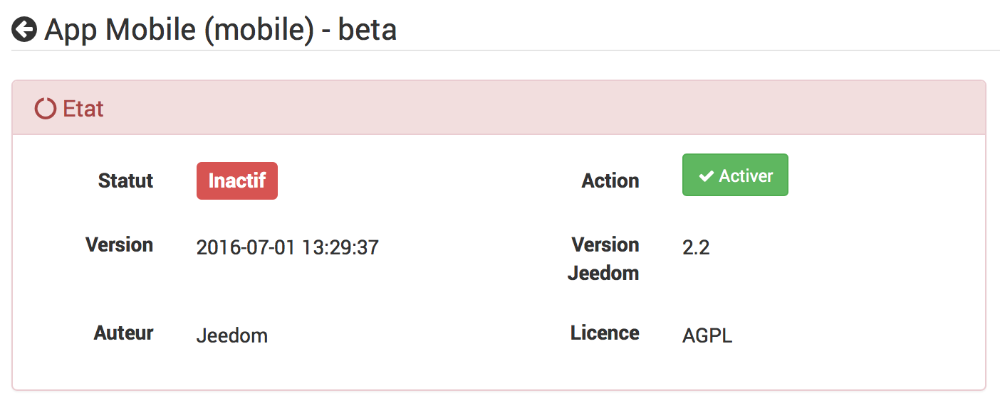
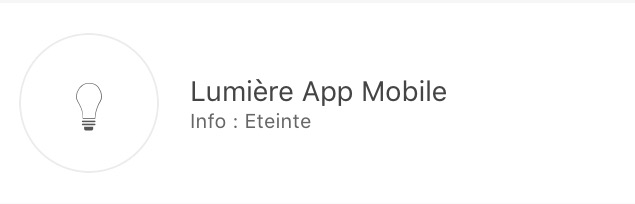
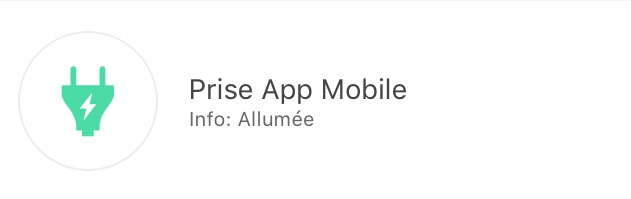
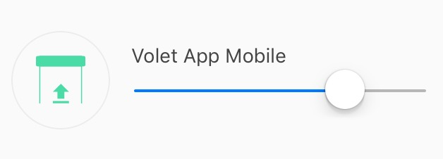
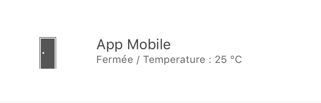
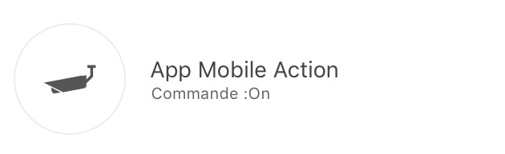

Plugin um die Mobile Jeedom Version zu verwenden.

Die Mobile Jeedom Anwendung erfordert die Einrichtung dieses Plugins,
damit sich die Box mit der Mobil App unterhalten kann.

Konfiguration des Mobil-Plugins
==============================

Nach der Installation des Plugin, aktivieren Sie es einfach :

**Konfiguration**

Um das Plugin zu konfigurieren, müssen Sie Handys hinzufügen, die auf
Jeedom zugreifen sollen.

So fügen Sie ein Handy hinzu : **Plugins**→**Kommunikation**→**Mobil App**→**Hinzufügen**

Hier sind die einzelnen Parameter erklärt :

-   **Mobil Gerätename** : Name des Telefons

-   **Aktivieren** : Aktivieren des Zugriffs für dieses Handy

-   **Mobil Typ** : Auswahl des Betriebssystems des Telefons (iOS, Android)

-   **Benutzer** : Benutzer, der diesem Zugriff zugeordnet ist

> **Tip**
>
> Die Wahl des Benutzers ist wichtig, weil es die Geräte bestimmt, zu denen
> dieser Zugriff, entsprechend seinen Rechten haben wird.

Nach dem Speichern erhalten Sie einen QR-Code, mit dem sich die App
ganz allein konfigurieren wird.

Konfigurieren von Plugins und Befehlen, die die App erhält
=======================================================

Nach der Initialisierung des Mobilen Plugins haben Sie die Möglichkeit, die
generischen Arten von Befehlen, Plugins und Parts zu überschreiben.

Wenn Sie auf ein Plugin klicken, können Sie es erlauben oder nicht, mit der
mobilen Anwendung zu kommunizieren und jeden mit ihren Befehlen
verknüpften generischen Typen zu konfigurieren.

Klicken Sie auf ein Teil, und Sie können es erlauben oder nicht, in der
Mobilen Anwendung anwesend zu sein und jeden der allgemeinen Typen
anzeigen, die mit seinen Befehlen verbunden sind.

Konfiguration der Mobil Anwendung
=====================================

Die Anwendungen finden Sie auf verschiedenen AppStore :

**Android Google Play**

**Apple App Store**

Erster Start der App
--------------------------

Bei dem 1. Start der mobilen Anwendung, wird eine Tutorial 
angeboten, das Ihnen bei der Konfiguration begleiten wird.

Nachdem Sie Ihre Mobile Jeedom Anwendung heruntergeladen und installiert haben,
führen Sie die Anwendung auf Ihrem Smartphone aus.

Sie kommen dann in ein Konfigurations-Tutorial, es wird empfohlen
diesem zu folgen. Einige Schritte wurden bereits ausgeführt.

Vous aurez ensuite le choix entre une configuration manuelle ou
automatique par QRcode. Si vous optez pour la configuration par QRcode,
il suffit de flasher le QRcode présent sur le plugin App Mobile dans
l’équipement smartphone créé précédemment. Dans ce cas, l’application va
récupérer automatiquement toute la configuration de votre Jeedom et se
connecter automatiquement. Lorsqu’il sera connecté chez vous en Wifi,
l’application utilisera automatiquement l’adresse Jeedom ethernet
interne à votre réseau. Lorsque vous serez connecté en 4G ou 3G, il
utilisera votre adresse externe pour se connecter à votre Jeedom (par
exemple via le service DNS Jeedom si vous l’utilisez). Si vous optez
pour la configuration manuelle, dans ce cas il vous faudra entrer à la
main les adresses IP interne et externe de votre Jeedom. Cette option
est réservée à un public averti.

Die Anwendung wird synchronisiert und Sie kommen auf seine
Homepage (mit einem vorangegangen mini Präsentationsführer).

Die mobile Jeedom Anwendung ist jetzt betriebsbereit.

Die Favoriten
-----------

Auf der Anwendung haben Sie die Favoriten (Verknüpfungen zu
Befehlen, Plugins, Szenarien).

Hier also ist der zu folgende Ablauf, zum erstellen :

Klicken Sie auf ein +, auf dem Startbildschirm der Anwendung :

Vous arriverez sur la page de sélection du type de raccourci :

Par exemple, nous allons prendre Action, il nous propose donc des
Pièces/Objets :

Il vous suffit alors de sélectionner l’action que vous souhaitez en
raccourci :

Il est ensuite possible de personnaliser la couleur de celle-ci (pour le
moment trois couleurs sont proposées) :

Ainsi que les deux textes associés :

 

Voilà, vous avez maitenant un raccourci de votre commande (dans la
version 1.1 il est prévu que les commandes On/Off apparaissent sur la
même touche).

Comment bien configurer ses types génériques 
============================================

Les Génériques Types dans le plugin Mobile 
------------------------------------------

Mieux que des mots, voici un exemple des génériques types pour une
lumière avec toutes ses commandes (voir aussi le tableau Lumière plus
bas) :

Tableaux des templates de l’application 
---------------------------------------

### Les Lumières #

Bild                           | generischer Typ               | Partie Dev plugin            | Beschreibung          |
:-----------------------------: | :--------------------------- | :--------------------------- | :------------------: |
 | `Lumière Bouton On` `Lumière Bouton Off` | `LIGHT_ON` `LIGHT_OFF`| présence de deux boutons "ON" et "Off" pas de retour d'état. |
 | `Lumière Bouton On` `Lumière Bouton Off` `Lumière Etat` | `LIGHT_ON` `LIGHT_OFF` `LIGHT_STATE` | Retour d'état présent, le bouton de gauche permet de switcher entre On et Off |
 | `Lumière Bouton Toggle` `Lumière Etat` | `LIGHT_TOGGLE` `LIGHT_STATE` | Retour d'état présent, le bouton de gauche permet de switcher entre On et Off |
 | `Lumière Bouton On` `Lumière Bouton Off` `Lumière Etat` `Lumière Slider` | `LIGHT_ON` `LIGHT_OFF` `LIGHT_STATE` `LIGHT_SLIDER` | Retour d'état présent, le bouton de gauche permet de switcher entre On et Off et le slider permet de contrôler l'intensité |
 | `Lumière Bouton On` `Lumière Bouton Off` `Lumière Etat` `Lumière Slider` `Lumière Couleur (info)` `Lumière Couleur (action)` `Lumière Mode` (optionnel, il sert à avoir des mode de lumière,par exemple arc-en-ciel sur les philips Hue) | `LIGHT_ON` `LIGHT_OFF` `LIGHT_STATE` `LIGHT_SLIDER` `LIGHT_COLOR` `LIGHT_SET_COLOR` `LIGHT_MODE` | Retour d'état présent, le bouton de gauche permet de switcher entre On et Off et le slider permet de contrôler l'intensité. Dans le cercle la couleur de la lampe est présente et lors d'un cloc dans celui-ci vous pouvez changer la couleur et activer un mode |

### Les Prises #

Bild                           | generischer Typ               | Partie Dev plugin            | Beschreibung          |
:-----------------------------: | :--------------------------- | :--------------------------- | :------------------: |
 | `Prise Bouton On` `Prise Bouton Off`| `ENERGY_ON` `ENERGY_OFF`| présence de deux boutons "ON" et "Off" pas de retour d'état. |
 | `Prise Bouton On` `Prise Bouton Off` `Prise Etat` | `ENERGY_ON` `ENERGY_OFF` `ENERGY_STATE` | Retour d'état présent, le bouton de gauche permet de switcher entre On et Off |
 | `Prise Bouton On` `Prise Bouton Off` `Prise Etat` `Prise Slider` | `ENERGY_ON` `ENERGY_OFF` `ENERGY_STATE` `ENERGY_SLIDER` | Retour d'état présent, le bouton de gauche permet de switcher entre On et Off et le slider permet de contrôler l'intensité |

### Les Volets #

Bild                           | generischer Typ               | Partie Dev plugin            | Beschreibung          |
:-----------------------------: | :--------------------------- | :--------------------------- | :------------------: |
   | `Volet Bouton Monter` `Volet Bouton Descendre` `Volet Bouton Stop` `Volet Etat`(optionnel) | `FLAP_UP` `FLAP_DOWN` `FLAP_STOP` `FLAP_STATE`(optionnel) | Présence de trois boutons "Monter", "Descendre", "Stop", retour d'état optionnel. |
   | `Volet Bouton Monter` `Volet Bouton Descendre` `Volet Bouton Stop` `Volet Etat` `Volet Bouton Slider` | `FLAP_UP` `FLAP_DOWN` `FLAP_STOP` `FLAP_STATE` `FLAP_SLIDER` | Présence d'un slider, avec un bouton Monter/Descendre en Toggle (avec icône d'état) |

### Inondation #

Bild                           | generischer Typ               | Partie Dev plugin            | Beschreibung          |
:-----------------------------: | :--------------------------- | :--------------------------- | :------------------: |
   | `Innondation` `Température`(optionnel) `Humidité`(optionnel) `Sabotage`(optionnel)|`FLOOD` `TEMPERATURE`(optionnel) `HUMIDITY`(optionnel) `HUMIDITY`(optionnel) | Permet d'avoir son capteur d'inondation complet sur une seule ligne.

### Serrure #

Bild                         | generischer Typ               | Partie Dev plugin            | Beschreibung          |
:---------------------------: | :--------------------------- | :--------------------------- | :------------------: |
   | `Serrure Etat` `Serrure Bouton Ouvrir` `Serrure Bouton Fermer` | `LOCK_STATE` `LOCK_OPEN` `LOCK_CLOSE` | Retour d'état présent, le bouton de gauche permet de switcher entre on et off |

### Sirène #

Bild                         | generischer Typ               | Partie Dev plugin            | Beschreibung          |
:---------------------------: | :--------------------------- | :--------------------------- | :------------------: |
   | `Sirène Etat` `Sirène Bouton On` `Sirène Bouton Off` | `SIREN_STATE` `SIREN_ON` `SIREN_OFF` | Retour d'état présent, le bouton de gauche permet de switcher entre on et off |

### Fumée #

Bild                           | generischer Typ               | Partie Dev plugin            | Beschreibung          |
:-----------------------------: | :--------------------------- | :--------------------------- | :------------------: |
   | `Fumée` `Température`(optionnel)|`SMOKE` `TEMPERATURE`(optionnel) | Permet d'avoir son capteur de fumée complet sur une seule ligne.

### Température #

Bild                                       | generischer Typ               | Partie Dev plugin            | Beschreibung          |
:-----------------------------------------: | :--------------------------- | :--------------------------- | :------------------: |
   | `Température` `Humidité`(optionnel)|`TEMPERATURE` `HUMIDITY`(optionnel) | Siehe Bild.

### Présence #

Bild                                 | generischer Typ               | Partie Dev plugin            | Beschreibung          |
:-----------------------------------: | :--------------------------- | :--------------------------- | :------------------: |
   | `Présence` `Température`(optionnel) `Luminosité`(optionnel) `Humidité`(optionnel) `UV`(optionnel) `Sabotage`(optionnel)|`PRESENCE` `TEMPERATURE`(optionnel) `BRIGHTNESS`(optionnel) `HUMIDITY`(optionnel) `UV`(optionnel) `SABOTAGE`(optionnel) | Voir image.

### Ouvrant #

Bild                                       | generischer Typ               | Partie Dev plugin            | Beschreibung          |
:-----------------------------------------: | :--------------------------- | :--------------------------- | :------------------: |
   | `Porte / Fenêtre` `Température`(optionnel)|`OPENING / OPENING_WINDOW` `TEMPERATURE`(optionnel) | Voir Image (à savoir que vous pouvez choisir entre fenêtre et porte).

### Fil pilote #

Bild                               | generischer Typ               | Partie Dev plugin            | Beschreibung          |
:---------------------------------: | :--------------------------- | :--------------------------- | :------------------: |
   | `Chauffage fil pilote Bouton ON` `Chauffage fil pilote bouton OFF` `Chauffage fil pilote Etat` `Chauffage fil pilote bouton`(optionnel) | `HEATING_ON` `HEATING_OFF` `HEATING_STATE` `HEATING_OTHER`|Les boutons ON/OFF et Etat permette de créer le bouton tout à gauche du template et les `chauffage fil pilote Bouton`sont là pour rajouter des boutons (5 max)

LES JOKERS 
----------

### Générique Action #

Bild                             | generischer Typ               | Partie Dev plugin            | Beschreibung          |
:-------------------------------: | :--------------------------- | :--------------------------- | :------------------: |
   | `Action Générique`           | `GENERIC_ACTION`             | Le bouton prend la forme du type de l'action. Par défaut c'est un toggle, si c'est un message alors vous avez une enveloppe, si slider vous avez un slider etc...

### Générique Info #

Bild                         | generischer Typ               | Partie Dev plugin            | Beschreibung          |
:---------------------------: | :--------------------------- | :--------------------------- | :------------------: |
   | `Information Générique`           | `GENERIC_INFO`             | Le bouton prend la forme du type de l'info.

Fehlersuche
===============

Mobil Hilfe
-----------

**→ Je suis sur Android version de l’app (1.0.1 ou 1.0.0) je n’arrive
pas à accéder à mes pièces ni même à la configuration de l’app.**

> **Caution**
>
> Vous avez eu un popup vous avertissant d’un souci sur les paramètres
> d’accessibilité, il vous suffit donc de vous rendre dans les
> paramètres d’accessibilité de votre mobile et de décocher les
> applications utilisant cette option. (Un correctif sera apporté
> prochainement sur l’app)

**→ J’ai un message dans une des lignes de mes modules me disant qu’il
manque un Type Générique !**

> **Tip**
>
> En lisant ce message, il vous dit quel type générique manque pour
> créer un template compatible. Il suffit juste de l’appliquer.
> Reportez-vous à la [doc chapitre Type
> Générique](https://www.jeedom.com/doc/documentation/plugins/mobile/fr_FR/mobile#_configuration_des_plugins_et_commandes_que_reçoit_l_app).

**→ J’ai un souci sur un des plugins dit complètement intégré (météo,
thermostat, alarme, caméra) !**

> **Tip**
>
> N’hésitez pas à accéder à votre module et de bien cliquer sur
> sauvegarder à nouveau, cela permettra de ré-inclure les types
> génériques associés au module.

**→ Impossible de mettre une info sur l’accueil de l’app !**

> **Tip**
>
> Cela est normal, ça sera disponible sur la version 1.1.

**→ J’ai l’application qui prend enormement de memoire dans mon
telephone !**

> **Tip**
>
> Il y avait un bug sur les versions 1.0.0 et 1.0.1 sur la partie
> Camera. Le souci ne ce reproduira plus avec la 1.0.2, pour supprimer
> le cache sans surprimer l’app, il suffit d’aller dans la configuration
> de votre App Mobile et de cliquer sur "supprimer le cache".

**→ J'ai un souci de premiere synchronisation sur l'app ou de sql sur le plugin mobile !**

> **Tip**
>
> il faut bien mettre des types génériques et autoriser le plugin a envoyer les generiques voir la doc un peux plus haut.
