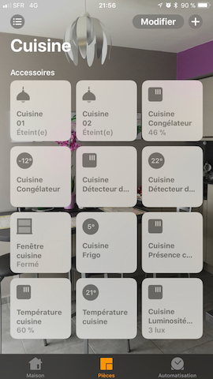
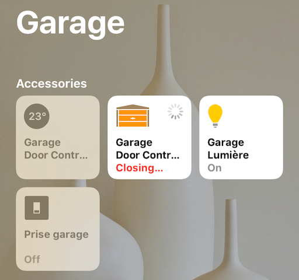
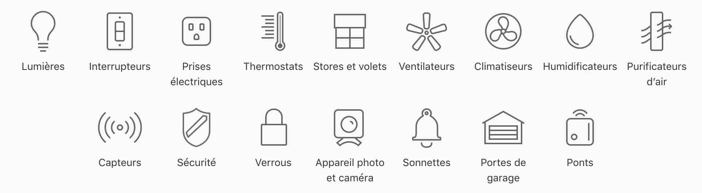

Présentation HomeBridge
=======================

*Le plugin Homebridge* est un demon qui permet d’interagir avec un système domotique via l’assistant vocal Siri sous iOS. Le HomeKit a été introduit depuis iOS 8, mais est véritablement opérationnel depuis iOS 10 via l’application Maison. 

Le plugin Homebridge de Jeedom permet donc d’exposer des équipements Jeedom qui seront vus comme des accessoires compatibles au protocole *HomeKit*.

>Homebridge n'est pas officiellement supporté par Apple. A tout moment Apple peut bloquer ce protocole.

Que peut-on faire avec HomeBridge ?
---------------------------------

Homebridge peut s'utiliser avec une application compatible HomeKit ou avec l'assistant vocal Siri.

Depuis iOS 10, l'application Maison (inclue par défaut avec iOS) permet le pilotage d'équipements compatibles HomeKit. 

Les équipements peuvent être classés par pièce.

Beaucoup d'accessoires sont pris en charge.

Siri peut aussi interagir. Il répond aux questions : 

Siri peut également faire des actions : 

HomeKit a l'avantage d'être utilisable à l'extérieur du domicile. Seule condition: il faut disposer d'un concentrateur. 
L'iPad et l'AppleTV (et bientôt le HomePod) peuvent servir de concentrateur. Pour cela, ils doivent être connectés au même compte iCloud.

>HomeKit est le nom officiel du protocole développé par Apple. Homebridge est son équivalent Open Source développé par nfarina. Ce dernier a étendu le projet HAP-NodeJS qui est le moteur d'Homebridge.

Type d'accessoire compatible avec HomeKit (on les ajoutera peu à peu à HomeBridge)
-------------------------------

Installation et activation du plugin Homebridge
==============================================

Le plugin Homebridge doit être installé via le market Jeedom. *Le plugin App Mobile officiel n'est plus indispensable.*

*Pour les migrations depuis le plugin App Mobile officiel, il est important de ne pas désactiver le plugin App Mobile. Une rubrique "Migration depuis le plugin App Mobile" est disponible dans la documentation.* 

Une fois le plugin installé, il suffit de l'activer en cliquant sur "Activer".

Installation des dépendances
----------------------------

Les dépendances sont installées automatiquement par Jeedom dans les 5 min. Elles seront également réinstallées lors d'une mise à jour du plugin si besoin.

*Le temps d'installation des dépendances peut varier en fonction du matériel utilisé.*

*Systèmes compatibles avec Homebridge :*

* Raspberry Pi 2 et 3 (Le Pi 3 est conseillé)

* Box Jeedom Mini +

* Box Jeedom pro

* Box Jeedom smart

* Box Jeedom pro V2

* Tout système basé sur Debian 8 ou 9

>Les installations sous Docker et Raspberry Pi 1 ne sont pas compatibles avec cette version de Homebridge.

Une fois les dépendances installées, le démon se lance (dans les 5 min). Si le statut n'est pas sur "OK", il faut cliquer sur "(Re)Démarrer".

Mise à jour manuelle des dépendances
------------------------------------

Pour mettre à jour manuellement les dépendances, il faut cliquer sur "Relancer".

Fichiers LOG
------------

Les fichiers log permettent d'analyser pas à pas l'activité interne du processus et ses interactions avec son environnement.

Ces fichiers peuvent être nécessaires en cas de dysfonctionnement du plugin.

* Homebridge : Historise toutes les communications avec le démon homebridge.

* Homebridge_daemon : Historise les actions effectuées par Homebridge (par exemple si un accessoire est envoyé à Homebridge mais n'apparaît pas dans l'application Maison, c'est ici qu'il faut aller voir).

* Homebridge_dep : Historise toutes les étapes de l'installation des dépendances. Si le démon refuse de démarrer par exemple, un coup d'oeil peut aider).

### titre 3.1

Test

### titre 3.2

test

Installation des dépendances
----------------------------

