Présentation du plugin mobile 
==============================

Le plugin mobile permet d'interagir avec Jeedom depuis un téléphone mobile ou une tablette via l'application officielle Jeedom. L'application est disponible sur les stores Android et Apple.

Que peut-on faire avec l'application mobile ?
---------------------------------------------

L'ensemble des interactions offert par jeedom est disponible depuis l'application mobile. Il est possible de piloter son éclairage, régler son chauffage, consulter ses températures, visionner et piloter ses caméras, piloter ses scénarios etc..

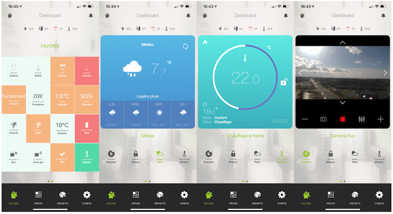

Installation du plugin mobile 
==============================

Le plugin mobile n'est pas intégré par défaut lors de l'installation de jeedom. Il faut disposer d'un compte sur le market de jeedom pour pouvoir l'installer. Les utilisateurs disposant d'un pack Power, Ultimate ou Pro peuvent installer gratuitement le plugin.
Les utilisateurs disposant d'un pack Community, devront s'acquitter de 4€ pour pouvoir bénéficier du plugin. 

Installation depuis le market
------------------------------

Pour installer le plugin mobile, il faut se rendre sur le market depuis l'interface web de jeedom via les menus "Plugin" et "gestion des plugins".

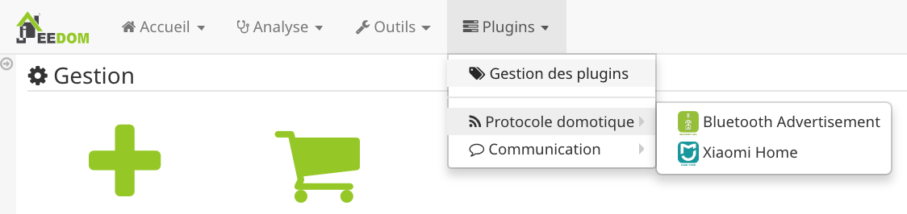

Il faut ensuite cliquer sur l'icône du market (chariot vert). Une fois dans le market, il suffit de cliquer sur l'icône "App mobile"

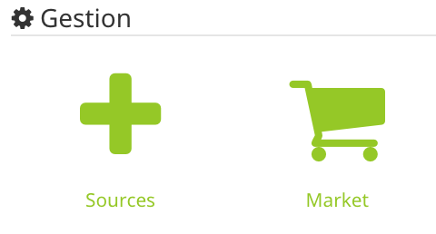 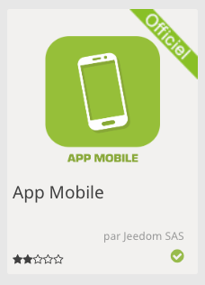

Pour installer le plugin, il faut cliquer sur installation. 

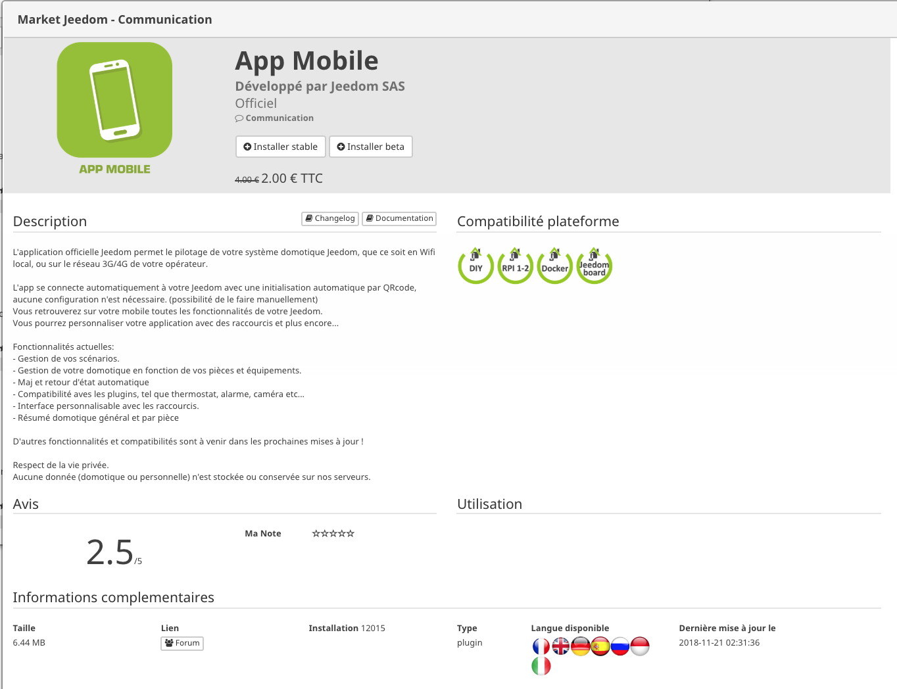

Une fois le plugin installé, il faut le configurer en cliquant sur le bouton "D'accord".

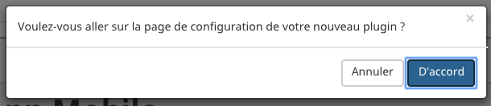

Configuration post installation
------------------------------

Après l'installation du plugin, il faut l'activer en cliquant sur "Activer". 

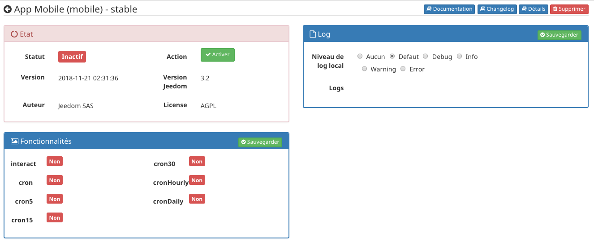

Une fois le plugin activer, il est possible d'activer la fonction "ask" des notifications en cliquant sur la coche associée.

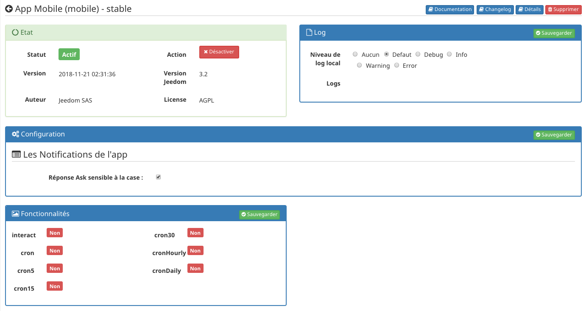

Configuration du plugin mobile 
==============================

Une fois le plugin installé, il faut le configurer via le menu "plugin", "communication" et "app mobile".

La première chose à faire est de configurer le plugin. Car si un téléphone est lié au plugin avant la configuration, il va falloir régénérer la configuration (un simple clic sur un bouton suffit).

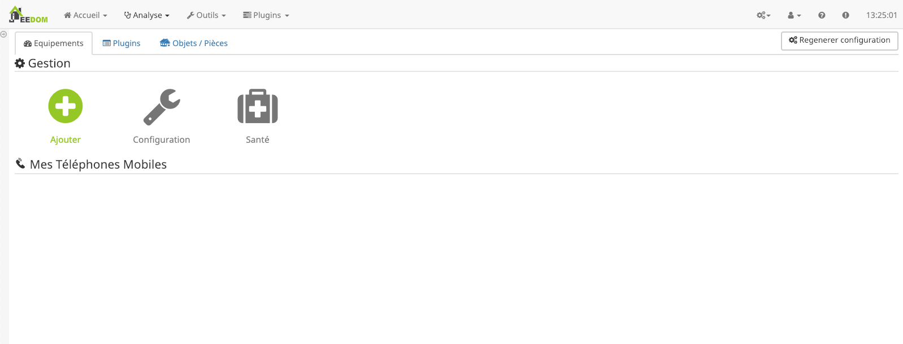

Pour configurer le plugin, il faut cliquer sur "plugin".

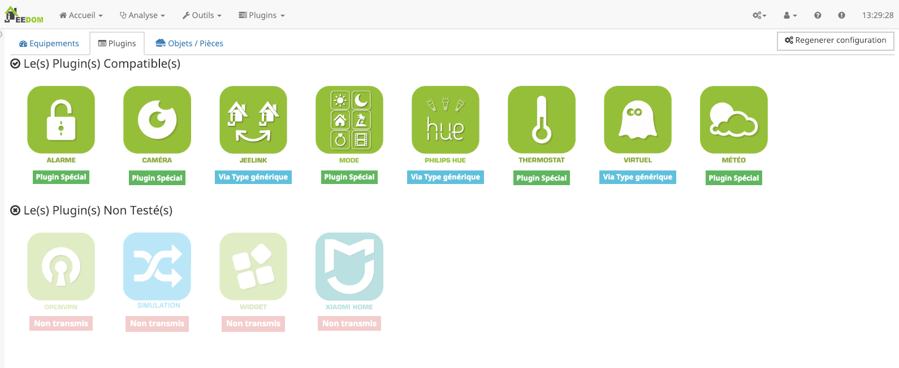

L'ensemble des plugins installés apparaissent. Certains sont compatibles nativement. Ce sont les plugin spéciaux(c'est à dire qu'il n'y a aucun manipulation à faire). Certains sont compatibles en configurant les types génériques. Enfin, certains (les plugins tiers généralement), sont non testés (cela ne veut pas dire qu'il ne sont pas compatibles, il faudra les configurer via les types génériques).

>Le support ne sera pas assuré sur les plugins non testés.

Les plugins spéciaux
---------------------

Il en existe 6.

* Plugin alarme
* Plugin caméra
* Plugin mode
* Plugin méteo
* Plugin thermostat
* Plugin thermostat-netatmo

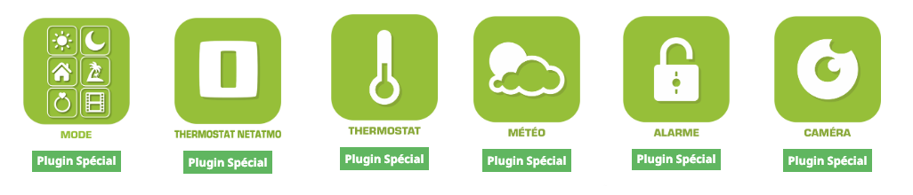

Comme expliquez précédemment, les plugins spéciaux ne nécessitent aucune configuration, ils sont pris en charge nativement par l'app mobile. 

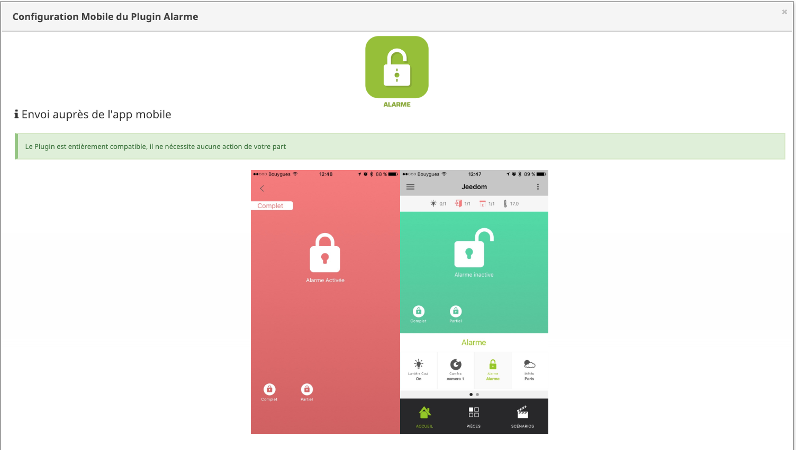

Les plugins via type générique
------------------------------

La plupart des plugins peuvent être utiliser sur l'app mobile via les types génériques.
Chaque commande (info ou action) doit être associée à un type générique.

L'exemple suivant correspond au plugin Hue.

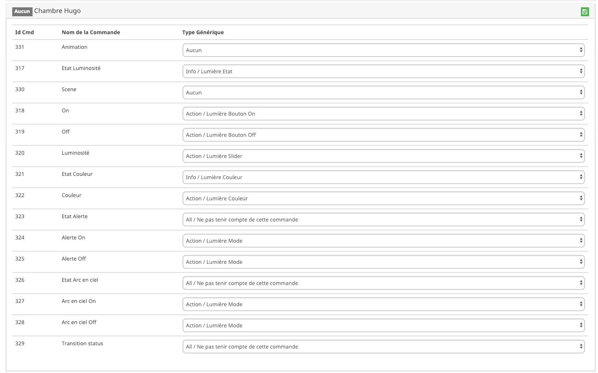

Sur certain plugin, les types génériques sont configurés automatiquement. Si, ils ne sont pas configurés, il faut les renseigner manuellement.
Il existe deux types de "type générique". L'action et l'info.
L'action pourra être utilisé pour allumer une lumière par exemple alors l'info sera utilisé pour donner une température.

Listes des types "info" : 

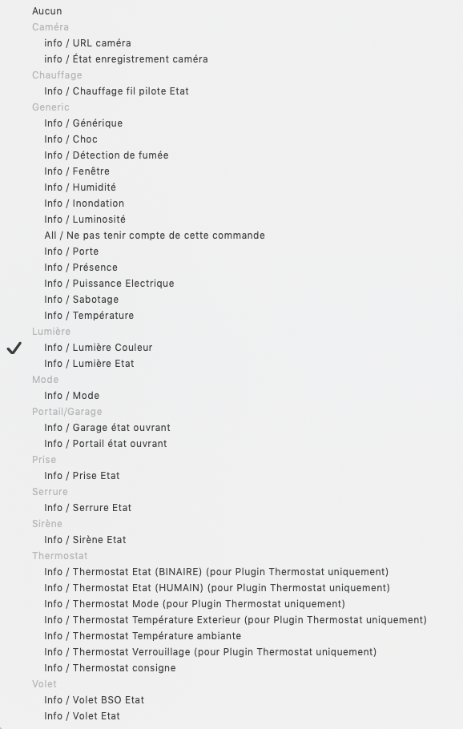

Listes des types "actions" :

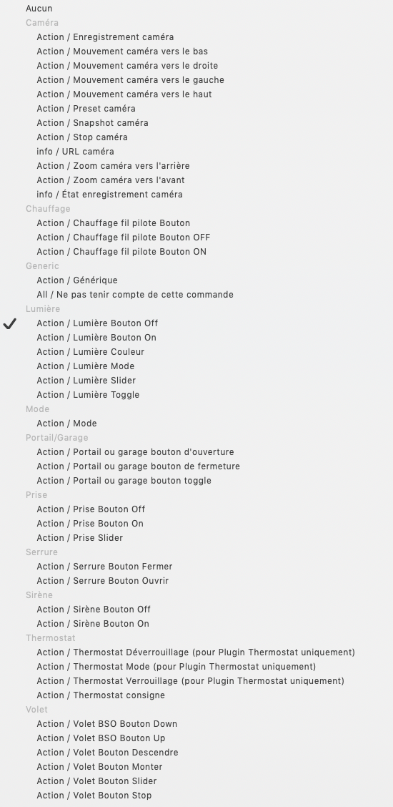

##Tableaux des templates de l’application #

### Les Lumières #

Image                           | type générique               | Partie Dev plugin            | Description          |
:-----------------------------: | :--------------------------- | :--------------------------- | :------------------: |
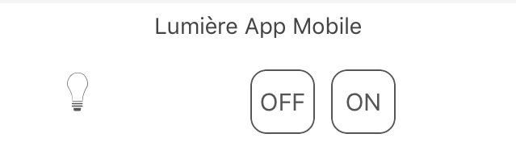 | `Lumière Bouton On` `Lumière Bouton Off` | `LIGHT_ON` `LIGHT_OFF`| présence de deux boutons "ON" et "Off" pas de retour d'état. |
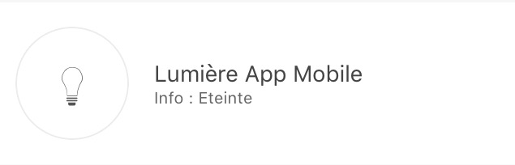 | `Lumière Bouton On` `Lumière Bouton Off` `Lumière Etat` | `LIGHT_ON` `LIGHT_OFF` `LIGHT_STATE` | Retour d'état présent, le bouton de gauche permet de switcher entre On et Off |
 | `Lumière Bouton Toggle` `Lumière Etat` | `LIGHT_TOGGLE` `LIGHT_STATE` | Retour d'état présent, le bouton de gauche permet de switcher entre On et Off |
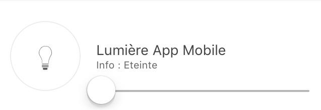 | `Lumière Bouton On` `Lumière Bouton Off` `Lumière Etat` `Lumière Slider` | `LIGHT_ON` `LIGHT_OFF` `LIGHT_STATE` `LIGHT_SLIDER` | Retour d'état présent, le bouton de gauche permet de switcher entre On et Off et le slider permet de contrôler l'intensité |
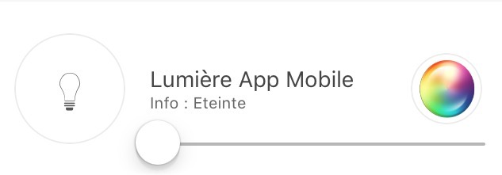 | `Lumière Bouton On` `Lumière Bouton Off` `Lumière Etat` `Lumière Slider` `Lumière Couleur (info)` `Lumière Couleur (action)` `Lumière Mode` (optionnel, il sert à avoir des mode de lumière,par exemple arc-en-ciel sur les philips Hue) | `LIGHT_ON` `LIGHT_OFF` `LIGHT_STATE` `LIGHT_SLIDER` `LIGHT_COLOR` `LIGHT_SET_COLOR` `LIGHT_MODE` | Retour d'état présent, le bouton de gauche permet de switcher entre On et Off et le slider permet de contrôler l'intensité. Dans le cercle la couleur de la lampe est présente et lors d'un cloc dans celui-ci vous pouvez changer la couleur et activer un mode |

### Les Prises #

Image                           | type générique               | Partie Dev plugin            | Description          |
:-----------------------------: | :--------------------------- | :--------------------------- | :------------------: |
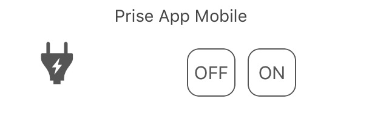 | `Prise Bouton On` `Prise Bouton Off`| `ENERGY_ON` `ENERGY_OFF`| présence de deux boutons "ON" et "Off" pas de retour d'état. |
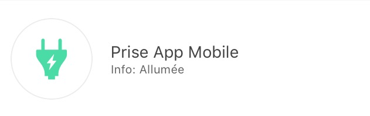 | `Prise Bouton On` `Prise Bouton Off` `Prise Etat` | `ENERGY_ON` `ENERGY_OFF` `ENERGY_STATE` | Retour d'état présent, le bouton de gauche permet de switcher entre On et Off |
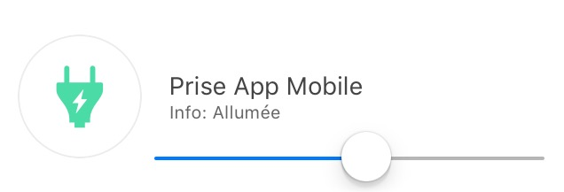 | `Prise Bouton On` `Prise Bouton Off` `Prise Etat` `Prise Slider` | `ENERGY_ON` `ENERGY_OFF` `ENERGY_STATE` `ENERGY_SLIDER` | Retour d'état présent, le bouton de gauche permet de switcher entre On et Off et le slider permet de contrôler l'intensité |

### Les Volets #

Image                           | type générique               | Partie Dev plugin            | Description          |
:-----------------------------: | :--------------------------- | :--------------------------- | :------------------: |
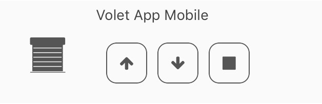   | `Volet Bouton Monter` `Volet Bouton Descendre` `Volet Bouton Stop` `Volet Etat`(optionnel) | `FLAP_UP` `FLAP_DOWN` `FLAP_STOP` `FLAP_STATE`(optionnel) | Présence de trois boutons "Monter", "Descendre", "Stop", retour d'état optionnel. |
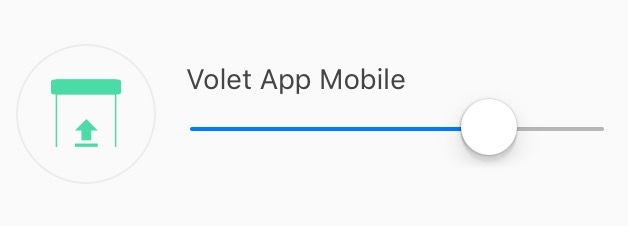   | `Volet Bouton Monter` `Volet Bouton Descendre` `Volet Bouton Stop` `Volet Etat` `Volet Bouton Slider` | `FLAP_UP` `FLAP_DOWN` `FLAP_STOP` `FLAP_STATE` `FLAP_SLIDER` | Présence d'un slider, avec un bouton Monter/Descendre en Toggle (avec icône d'état) |

### Inondation #

Image                           | type générique               | Partie Dev plugin            | Description          |
:-----------------------------: | :--------------------------- | :--------------------------- | :------------------: |
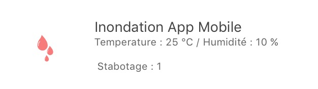   | `Innondation` `Température`(optionnel) `Humidité`(optionnel) `Sabotage`(optionnel)|`FLOOD` `TEMPERATURE`(optionnel) `HUMIDITY`(optionnel) `HUMIDITY`(optionnel) | Permet d'avoir son capteur d'inondation complet sur une seule ligne.

### Serrure #

Image                         | type générique               | Partie Dev plugin            | Description          |
:---------------------------: | :--------------------------- | :--------------------------- | :------------------: |
   | `Serrure Etat` `Serrure Bouton Ouvrir` `Serrure Bouton Fermer` | `LOCK_STATE` `LOCK_OPEN` `LOCK_CLOSE` | Retour d'état présent, le bouton de gauche permet de switcher entre on et off |

### Sirène #

Image                         | type générique               | Partie Dev plugin            | Description          |
:---------------------------: | :--------------------------- | :--------------------------- | :------------------: |
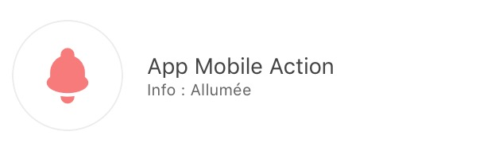   | `Sirène Etat` `Sirène Bouton On` `Sirène Bouton Off` | `SIREN_STATE` `SIREN_ON` `SIREN_OFF` | Retour d'état présent, le bouton de gauche permet de switcher entre on et off |

### Fumée #

Image                           | type générique               | Partie Dev plugin            | Description          |
:-----------------------------: | :--------------------------- | :--------------------------- | :------------------: |
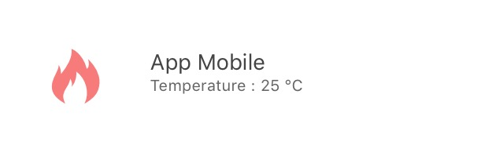   | `Fumée` `Température`(optionnel)|`SMOKE` `TEMPERATURE`(optionnel) | Permet d'avoir son capteur de fumée complet sur une seule ligne.

### Température #

Image                                       | type générique               | Partie Dev plugin            | Description          |
:-----------------------------------------: | :--------------------------- | :--------------------------- | :------------------: |
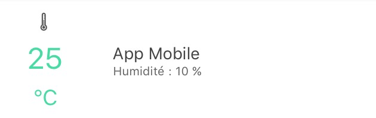   | `Température` `Humidité`(optionnel)|`TEMPERATURE` `HUMIDITY`(optionnel) | Voir Image.

### Présence #

Image                                 | type générique               | Partie Dev plugin            | Description          |
:-----------------------------------: | :--------------------------- | :--------------------------- | :------------------: |
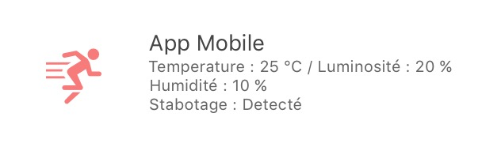   | `Présence` `Température`(optionnel) `Luminosité`(optionnel) `Humidité`(optionnel) `UV`(optionnel) `Sabotage`(optionnel)|`PRESENCE` `TEMPERATURE`(optionnel) `BRIGHTNESS`(optionnel) `HUMIDITY`(optionnel) `UV`(optionnel) `SABOTAGE`(optionnel) | Voir image.

### Ouvrant #

Image                                       | type générique               | Partie Dev plugin            | Description          |
:-----------------------------------------: | :--------------------------- | :--------------------------- | :------------------: |
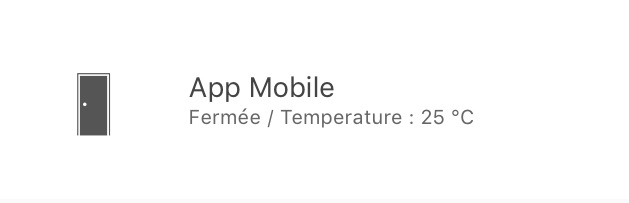   | `Porte / Fenêtre` `Température`(optionnel)|`OPENING / OPENING_WINDOW` `TEMPERATURE`(optionnel) | Voir Image (à savoir que vous pouvez choisir entre fenêtre et porte).

### Fil pilote #

Image                               | type générique               | Partie Dev plugin            | Description          |
:---------------------------------: | :--------------------------- | :--------------------------- | :------------------: |
   | `Chauffage fil pilote Bouton ON` `Chauffage fil pilote bouton OFF` `Chauffage fil pilote Etat` `Chauffage fil pilote bouton`(optionnel) | `HEATING_ON` `HEATING_OFF` `HEATING_STATE` `HEATING_OTHER`|Les boutons ON/OFF et Etat permette de créer le bouton tout à gauche du template et les `chauffage fil pilote Bouton`sont là pour rajouter des boutons (5 max)

### Générique Action #

Image                             | type générique               | Partie Dev plugin            | Description          |
:-------------------------------: | :--------------------------- | :--------------------------- | :------------------: |
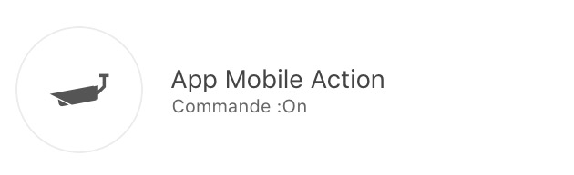   | `Action Générique`           | `GENERIC_ACTION`             | Le bouton prend la forme du type de l'action. Par défaut c'est un toggle, si c'est un message alors vous avez une enveloppe, si slider vous avez un slider etc...

### Générique Info #

Image                         | type générique               | Partie Dev plugin            | Description          |
:---------------------------: | :--------------------------- | :--------------------------- | :------------------: |
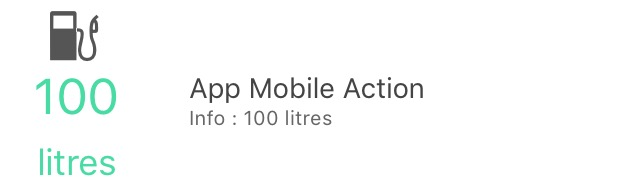   | `Information Générique`           | `GENERIC_INFO`             | Le bouton prend la forme du type de l'info.

