Présentation Homebridge
=======================

*Le plugin Homebridge* est un demon qui permet d’interagir avec un système domotique via l’assistant vocal Siri sous iOS. Le HomeKit a été introduit depuis iOS 8, mais est véritablement opérationnel depuis iOS 10 via l’application Maison. 

Le plugin Homebridge de Jeedom permet donc d’exposer des équipements Jeedom qui seront vus comme des accessoires compatibles au protocole *HomeKit*.

>Homebridge n'est pas officiellement supporté par Apple. A tout moment Apple peut bloquer ce protocole.

Que peut-on faire avec Homebridge ?
---------------------------------

Homebridge peut s'utiliser avec une application compatible HomeKit ou avec l'assistant vocal Siri.

Depuis iOS 10, l'application Maison (inclue par défaut avec iOS) permet le pilotage d'équipements compatibles HomeKit. 

  

Les équipements peuvent être classés par pièce. Il est également possible de mettre des accessoires en favoris sur la pages d'accueil. Une page spécifique indique l'ensemble des états des accessoires.

  

Beaucoup d'accessoires sont pris en charge.

Siri peut aussi interagir. Il répond aux questions et fait des actions.  

 

HomeKit a l'avantage d'être utilisable à l'extérieur du domicile. Seule condition: il faut disposer d'un concentrateur. 
L'iPad et l'AppleTV (et bientôt le HomePod) peuvent servir de concentrateur. Pour cela, ils doivent être connectés au même compte iCloud.

>HomeKit est le nom officiel du protocole développé par Apple. Homebridge est son équivalent Open Source développé par nfarina. Ce dernier a étendu le projet HAP-NodeJS qui est le moteur d'Homebridge.

Installation et activation du plugin Homebridge
==============================================

Le plugin Homebridge doit être installé via le market Jeedom. *Le plugin App Mobile officiel n'est plus indispensable.*

*Pour les migrations depuis le plugin App Mobile officiel, il est important de ne pas désactiver le plugin App Mobile. Une rubrique "Migration depuis le plugin App Mobile" est disponible dans la documentation.* 

 

Une fois le plugin installé, il suffit de l'activer en cliquant sur "Activer".

Installation des dépendances
----------------------------

Les dépendances sont installées automatiquement par Jeedom dans les 5 min. Elles seront également réinstallées lors d'une mise à jour du plugin si besoin.

*Le temps d'installation des dépendances peut varier en fonction du matériel utilisé.*

*Systèmes compatibles avec Homebridge :*

* Raspberry Pi 2 et 3 (Le Pi 3 est conseillé)

* Box Jeedom Mini +

* Box Jeedom pro

* Box Jeedom smart

* Box Jeedom pro V2

* Tout système basé sur Debian 8 ou 9

>Les installations sous Docker et Raspberry Pi 1 ne sont pas compatibles avec cette version de Homebridge.

Une fois les dépendances installées, le démon se lance (dans les 5 min). Si le statut n'est pas sur "OK", il faut cliquer sur "(Re)Démarrer".

Mise à jour manuelle des dépendances
------------------------------------

Pour mettre à jour manuellement les dépendances, il faut cliquer sur "Relancer".

Fichiers LOG
------------

Les fichiers log permettent d'analyser pas à pas l'activité interne du processus et ses interactions avec son environnement.

Ces fichiers peuvent être nécessaires en cas de dysfonctionnement du plugin.

* Homebridge : Historise toutes les communications avec le démon homebridge.

* Homebridge_daemon : Historise les actions effectuées par Homebridge (par exemple si un accessoire est envoyé à Homebridge mais n'apparaît pas dans l'application Maison, c'est ici qu'il faut aller voir).

* Homebridge_dep : Historise toutes les étapes de l'installation des dépendances. Si le démon refuse de démarrer par exemple, un coup d'oeil peut aider).

Configuration du plugin Homebridge
=================================

Création du pont Homebridge
--------------------------

Pour créer le pont Homebridge, il faut aller dans la rubrique "Gestion", et cliquer sur "Configuration".

Pour créer le pont, il suffit de lui donner un nom et un code "PIN".

* *Nom Homebridge* : Permet de nommer le pont Homebridge. 

>Le changement de nom Homebridge obligera à reconfigurer les applications HomeKit.

* *PIN Homebridge* : Permet de personnaliser le code PIN Homebridge.

>Les PIN suivants ne sont pas acceptés par Apple : 000-00-000, 111-11-111, 222-22-222 -> 999-99-999, 123-45-678, 876-54-321. Son changement obligera la reconfiguration des applications HomeKit.

* *Réparer* :  Permet une réparation de Homebridge en modifiant les identifiants. 

>Il faut retirer le bridge de l'application "Maison".

* *Réparer & réinstaller* : Supprime et réinstalle complètement Homebridge. 

>A n'effectuer que sur conseil d'un membre du forum et il faut retirer le pont de l'application "Maison".

* *Plateforme Homebridge supplémentaire* : Permet de rajouter manuellement un plugin Homebridge de type plateforme (homebridge-camera-ffmpeg ou homebridge-nest par exemple).

* *Accessoire Homebridge supplémentaire* : Permet de rajouter manuellement un plugin Homebridge de type accessoire (homebridge-freemote par exemple).

>Réservé à un public averti. Il n'y aura aucun support pour ces deux dernières parties.

Une fois les cases *nom Homebridge et PIN Homebridge* correctement renseignées, la configuration se finalise en cliquant sur **Sauvegarder**. Le démon redémarre.

>Un QR code est généré automatiquement. Cela améliore l'intégration du pont jeedom dans Homekit. Voir la partie "Ajout de Jeedom dans HomeKit".

Ajout des accessoires dans Homebridge
------------------------------------

Les équipements seront à ajouter manuellement. 

Afin d'intégrer un accessoire dans Homebridge, il faut sélectionner la pièce où il se trouve.

Afin d'ajouter un accessoire à Homebridge, il suffit de cocher la case "Envoyer à Homebridge". Pour sauvegarder, il suffit de cliquer sur la petite disquette verte.

>Si des modifications ont été faites, comme le changement du type générique, la modification d'un paramètre, l'ajout d'un accessoire il faut impérativement redémarrer le Démon pour la prise en compte dans Homebridge.

Configuration des types génériques
=================================

Généralités
----------

En cliquant sur l'équipement, les types génériques utilisés pour la communication entre votre Jeedom et Homebridge apparaissent.

La majorité des types génériques est déjà renseignée. Dans certains cas, une configuration manuelle sera nécessaire (pour le plugin Virtuel par exemple).

Voici les types génériques disponibles : 

Pour les informations : 

Pour les actions : 

Lumière
----------
-----------------------------------------------------
Type générique  | Obligatoire | Valeurs possibles |
---------------|:----------------:|----------------|
 Info/Lumière Etat (Binaire)| `NON`|Ajout pour les lumières dont la luminosité ne change pas lorsqu’elle est éteinte (Yeelight, Ikea, …​) 0 = Eteint Autre que 0 = Allumé
   Info/Lumière Etat|   `OUI`|Luminosité 0-100 Ou 0-99 ou 0-255 (en fonction du max de Action/Lumière Slider) ou Binaire 0 = Eteint  autre que 0 = Allumé| 
Action/Lumière Slider (Luminosité)| `Oui`| Réf. vers Lumière Etat
Action/Lumière Bouton On| `Oui`|Réf. vers Lumière Etat : - Binaire s’il est présent - Etat sinon
Action/Lumière Bouton Off| `Oui`|Réf. vers Lumière Etat : - Binaire s’il est présent - Etat sinon
| Row1 Cell1    |   Row1 Cell2   |
| Row1 Cell1    |   Row1 Cell2   |
| Row1 Cell1    |   Row1 Cell2   |
| Row1 Cell1    |   Row1 Cell2   |
| Row1 Cell1    |   Row1 Cell2   |
| Row1 Cell1    |   Row1 Cell2   |

*Des exemples de configurations sont disponibles à la fin de la documentation*

Pour valider, il faut aller dans la configuration du plugin et relancer le démon Homebridge en cliquant sur "(Re)Démarrer".

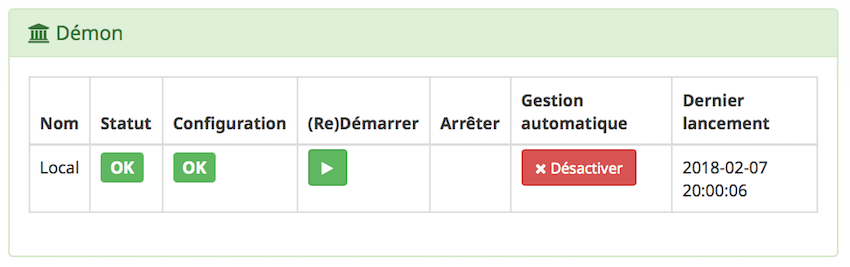

Ajout de Jeedom dans HomeKit
===========================

Il existe plusieurs applications sur l'appstore compatibles HomeKit. L'application "Maison" d'Apple sera utilisée pour la rédaction de la documentation.

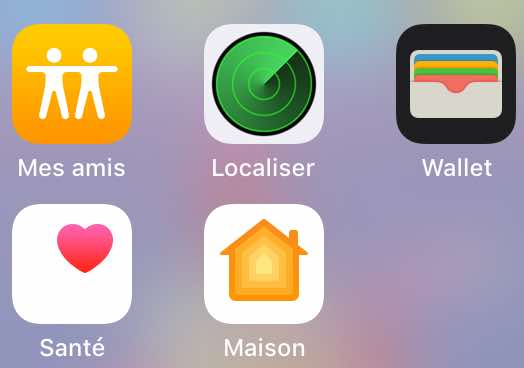

Le pont peur être inclu manuellement en entrant le code PIN et en sélectionnant le pont ou automatiquement en scannant le QR code.

Ajout du pont par QR code
-------------------------

Pour ajouter le pont dans Homekit, il suffit de scanner le QR code avec l'application "Appareil photo". 

Une notification est affichée en haut de l'écran. Il suffit de cliquer dessus et le pont est inclu automatiquement dans Homekit.

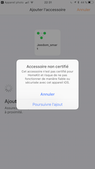

>Comme expliqué plus haut dans la doc, Homebridge n'est pas reconnu officiellement par Apple. Un message indique que l'accessoire n'est pas certifié, il faut valider l'inclusion en cliquant sur "Poursuivre l'ajout".

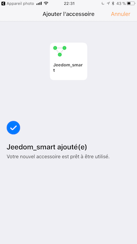

Le pont est maintenant intégré dans Homekit.

Ajout manuel du pont
-------------------

L'inclusion de Jeedom dans HomeKit, se fait en ouvrant l'application "Maison" et en cliquant sur "Ajouter un accessoire". 

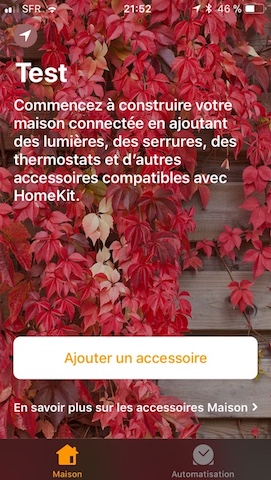

>Dans l'exemple, le domicile s'appelle "Test". Son nom peut être modifié en allant dans les réglages de l'application.

Il faut scanner le code PIN 

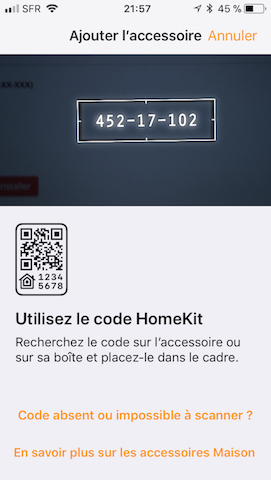

>Le code PIN peut être également rentré manuellement en cliquant sur "Code absent ou impossible à scanner ?".

Il faut sélectionner le pont à inclure.

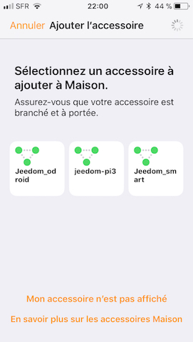

>Comme expliqué plus haut dans la doc, Homebridge n'est pas reconnu officiellement par Apple. Un message indique que l'accessoire n'est pas certifié, il faut valider l'inclusion en cliquant sur "Poursuivre l'ajout".

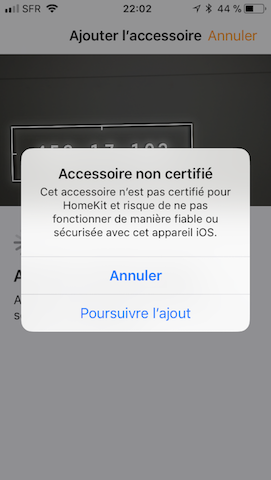

*Le pont Jeedom est maintenant intégré à HomeKit.*

>Il n'est pas possible d'inclure le pont Jeedom sur plusieurs appareils IOS. Pour utiliser Homebridge sur plusieurs appareils IOS, il suffit de partager le domicile en suivant la procédure suivante :

Rangement des accessoires dans HomeKit
====================================

Les accessoires doivent être rangés correctement dans HomeKit. Il faudra créer des pièces pour y intégrer les accessoires.

>Les pièces dans Jeedom ne sont pas importées dans Homebridge. Ceci n'est pas dû à Jeedom mais à la gestion des pièces par Apple.

Le premier accessoire à "ranger" est le pont Jeedom. 

Il faut sélectionner la pièce où sera installé le pont. Si elle n'existe pas, il faudra la créer en cliquant sur "Créer".

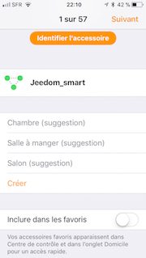

Définir le nom de la nouvelle pièce. Il est également possible de lui attribuer un fond d'écran dédié. Pour finaliser la création de la pièce, il faut cliquer sur "Enregistrer".

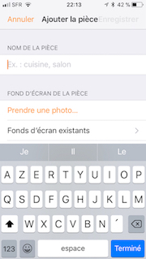

Maintenant, il ne reste plus qu'à ranger tous les accessoires dans les différentes pièces.

>La fonction "Inclure dans les favoris" permet d'afficher l'accessoire dans la page principale de l'application

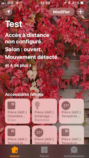

*Les accessoires doivent être "rangés" un par un. Si il y en a beaucoup, cette partie prendra du temps*.

La documentation complète de l'application "Maison" d'Apple est disponible à cette adresse : https://support.apple.com/fr-fr/HT204893.

