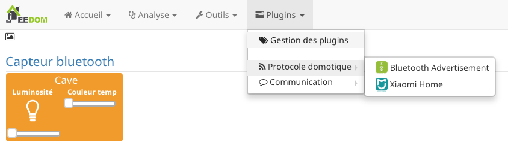

Présentation du plugin mobile 
==============================

Le plugin mobile permet d'interagir avec Jeedom depuis un téléphone mobile ou une tablette via l'application officielle Jeedom. L'application est disponible sur les stores Android et Apple.

Que peut-on faire avec l'application mobile ?
---------------------------------------------

L'ensemble des interactions offert par jeedom est disponible depuis l'application mobile. Il est possible de piloter son éclairage, régler son chauffage, consulter ses températures, visionner et piloter ses caméras, piloter ses scénarios etc..

Installation du plugin mobile 
==============================

Le plugin mobile n'est pas intégré par défaut lors de l'installation de jeedom. Il faut disposer d'un compte sur le market de jeedom pour pouvoir l'installer. Les utilisateurs disposant d'un pack Power, Ultimate ou Pro peuvent installer gratuitement le plugin.
Les utilisateurs disposant d'un pack Community, devront s'acquitter de 4€ pour pouvoir bénéficier du plugin. 

Installation depuis le market
------------------------------

Pour installer le plugin mobile, il faut se rendre sur le market depuis l'interface web de jeedom via les menus "Plugin" et "gestion des plugins".

Il faut ensuite cliquer sur l'icône du market (chariot vert). Une fois dans le market, il suffit de cliquer sur l'icône "App mobile"

 

Pour installer le plugin, il faut cliquer sur installation. 

Une fois le plugin installé, il faut le configurer en cliquant sur le bouton "d'accord".

Configuration post installation
------------------------------

