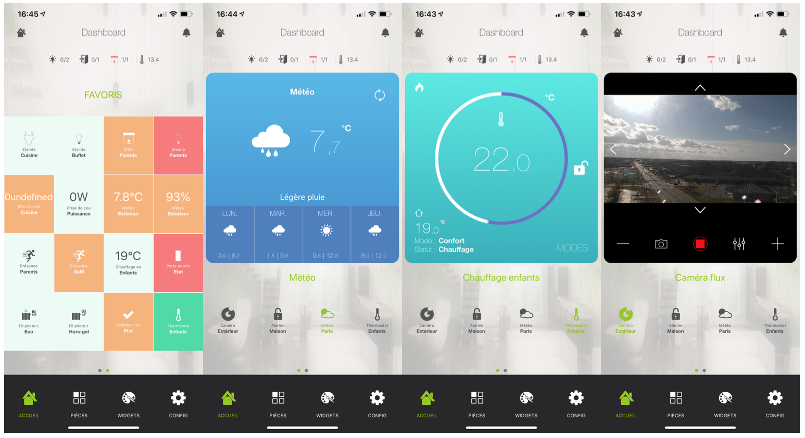

Présentation du plugin mobile 
==============================

Le plugin mobile permet d'interagir avec Jeedom depuis un téléphone mobile ou une tablette via l'application officielle Jeedom. L'application est disponible sur les stores Android et Apple.

Que peut-on faire avec l'application mobile ?
---------------------------------------------

L'ensemble des interactions offert par jeedom est disponible depuis l'application mobile. Il est possible de piloter son éclairage, régler son chauffage, consulter ses températures, visionner et piloter ses caméras, piloter ses scénarios etc..

Installation du plugin mobile 
==============================

Le plugin mobile n'est pas intégré par défaut lors de l'installation de jeedom. Il faut disposer d'un compte sur le market de jeedom pour pouvoir l'installer. Les utilisateurs disposant d'un pack Power, Ultimate ou Pro peuvent installer gratuitement le plugin.
Les utilisateurs disposant d'un pack Community, devront s'acquitter de 4€ pour pouvoir bénéficier du plugin. 

Installation depuis le market
------------------------------

Pour installer le plugin mobile, il faut se rendre sur le market depuis l'interface web de jeedom via les menus "Plugin" et "gestion des plugins".

Il faut ensuite cliquer sur l'icône du market (chariot vert). Une fois dans le market, il suffit de cliquer sur l'icône "App mobile"

 

Pour installer le plugin, il faut cliquer sur installation. 

Une fois le plugin installé, il faut le configurer en cliquant sur le bouton "D'accord".

Configuration post installation
------------------------------

Après l'installation du plugin, il faut l'activer en cliquant sur "Activer". 

Une fois le plugin activer, il est possible d'activer la fonction "ask" des notifications en cliquant sur la coche associée.

Configuration du plugin mobile 
==============================

Une fois le plugin installé, il faut le configurer via le menu "plugin", "communication" et "app mobile".

La première chose à faire est de configurer le plugin. Car si un téléphone est lié au plugin avant la configuration, il va falloir régénérer la configuration (un simple clic sur un bouton suffit).

Pour configurer le plugin, il faut cliquer sur "plugin".

L'ensemble des plugins installés apparaissent. Certains sont compatibles nativement. Ce sont les plugin spéciaux(c'est à dire qu'il n'y a aucun manipulation à faire). Certains sont compatibles en configurant les types génériques. Enfin, certains (les plugins tiers généralement), sont non testés (cela ne veut pas dire qu'il ne sont pas compatibles, il faudra les configurer via les types génériques).

>Le support ne sera pas assuré sur les plugins non testés.

Les plugins spéciaux
---------------------

